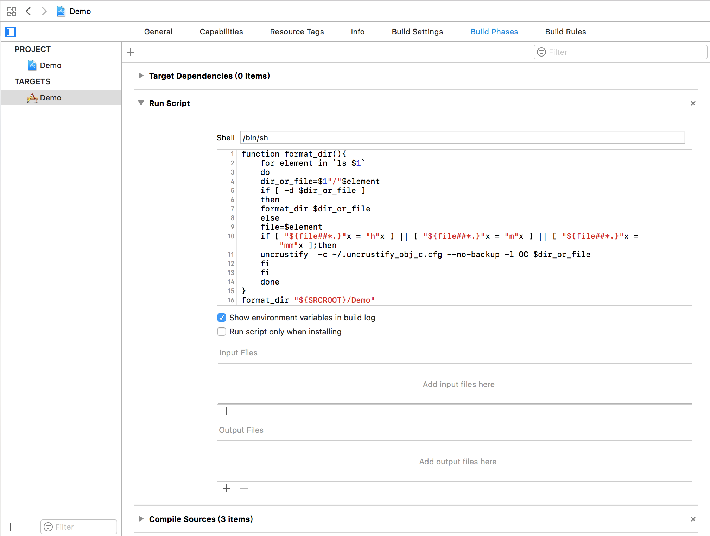

# Objc Formatter
A simple way for formatting the Objective-C codes in XCode

## Prerequisites

>Install uncrustify

```shell
brew install uncrustify
```

>Config uncrustify

Download [uncrustify_obj_c.txt](uncrustify_obj_c.txt)

```shell
mv uncrustify_obj_c.txt ~/.uncrustify_obj_c.cfg
```

Or you can use your own config file.

## How to use it

In the Build Phases section of your project target, add a new Run Script phase before the Compile Sources step.

The script should be

```shell
function format_dir(){
    for element in `ls $1`
    do
        dir_or_file=$1"/"$element
        if [ -d $dir_or_file ]
        then
            format_dir $dir_or_file
        else
            file=$element
            if [ "${file##*.}"x = "h"x ] || [ "${file##*.}"x = "m"x ] || [ "${file##*.}"x = "mm"x ];then
                uncrustify  -c ~/.uncrustify_obj_c.cfg --no-backup -l OC $dir_or_file
            fi
        fi
    done
}

format_dir "${SRCROOT}/path/to/your/objc/code/"
```

Change the path to your objc code's folder

If you have another objc code's folder to format, just call another format_dir().

e.g.


Now build your project, and the objc codes will be auto formatted.

## License

This project is licensed under the MIT License - see the [LICENSE.md](LICENSE.md) file for details
